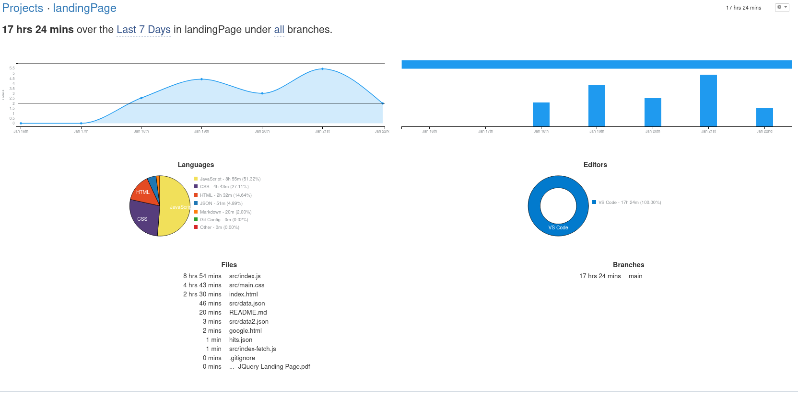

# Landing Page from hotel T.D.
### [Website in production](https://javix64.github.io/landingPage-Jquery)

This is a landing page project for web design and JS subjects.

Photos and video are not mine. 

Services photos are hotlinked from another sites.

Testimonials photos are created in [This Person Does Not Exist](https://thispersondoesnotexist.com/).

## Total time in [WakaTime]([https://link](https://wakatime.com/@8c413fb3-2356-4d3d-acf6-fbe71e974e55/projects/udapthflgm?start=2021-01-15&end=2021-01-21))

## Technologies that i used
- Jquery
- CSS/FlexBox
- HTML5

## Methods in Jquery
- Ajax to creating services and testimonials articles.
- Slow animation to scroll into correct section.
- Forward animation  for images.
- Geolocation( it's give me lat and long)
- Form validation with events.
